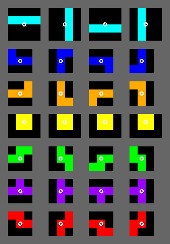

# RL for Tetris powered by Rust

RL stands for Reinforcement Learning.

## Installation and run

## Useful stuff

### Super Rotation System



### Install dependencies
```bash
cargo install cargo-tree
cargo tree  # to see the tree
 
# for ncurses dependency
sudo apt install libncurses5-dev
```

https://tetris.fandom.com/wiki/Tetris_Guideline

https://tetris.fandom.com/wiki/SRS, especially
[Wall kicks](https://tetris.fandom.com/wiki/SRS?section=3)


